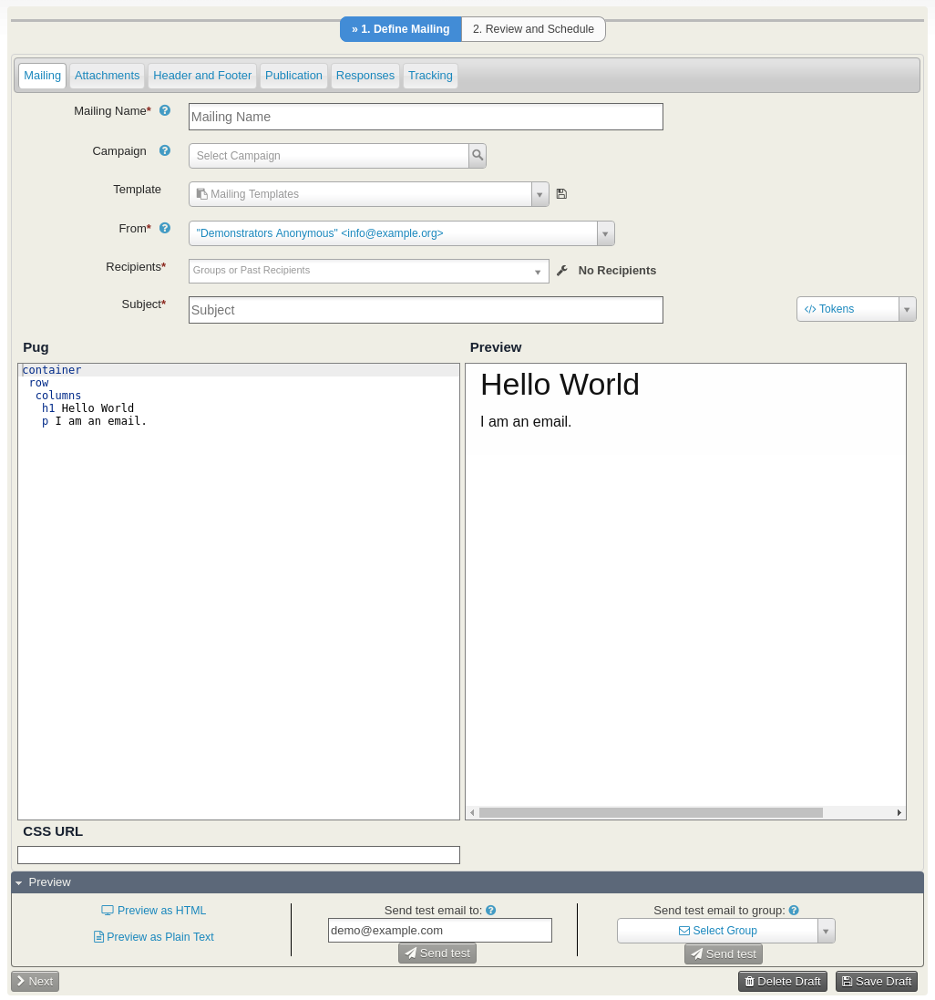

# CiviCRM Inky Compose

CiviCRM Inky Compose is a CiviCRM extension that allows you to compose emails using the Inky email templating language, written in Pug.

It is built upon the following principles:

* Make the input as concise as possible
* Make the output as beautiful as possible

You may love it or hate it.  If you hate it, check out [Mosaico](https://civicrm.org/extensions/email-template-builder).

## Requirements

CiviCRM 4.7

## Installation

1. Download a release from https://github.com/3sd/civicrm-inky-compose/releases to your extensions directory
2. Browse to **Administer > System Settings > Extensions**
3. Find **Inky Compose** and click **Install**

## Getting started

Once you have installed the extension, you should see an additional menu item at the bottom of the **Mailings** menu: ***New Inky Mailing***.

Clicking on this will bring up the familiar email compose screen with the following differences:

* The text area for composing your email will be replaced with a split screen. On the left hand side, you should enter Inky text in Pug format. On the right hand side will be outputted email friendly HTML.
* Include CSS in your email by adding a CSS URL to the CSS field.

You may find the following references useful:

* https://foundation.zurb.com/emails/docs/inky.html
* https://pugjs.org/api/getting-started.html

## Developers

Developers may be interested in the developer notes in the docs directory of this repository.

## Credits

This extension has been developed by [Michael McAndrew](https://twitter.com/michaelmcandrew) from [Third Sector Design](https://thirdsectordesign.org/) who you can [contact](https://thirdsectordesign.org/contact) for help, support and further development.

Funding for this extension was generously provided by [eLife Sciences](https://elifesciences.org/), a unique, non-profit collaboration between the funders and practitioners of research to improve the way important results are presented and shared.

## Contributing

Contributions to this repository are very welcome. For small changes, feel free to submit a pull request. For larger changes, please create an issue first so we can talk about your ideas.

## License

This extension is licensed under [AGPL-3.0](LICENSE.txt).
